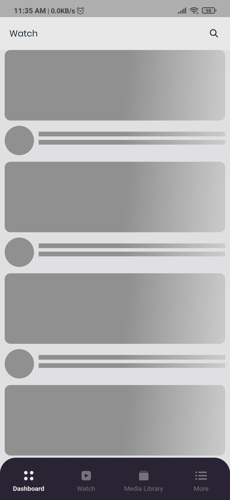
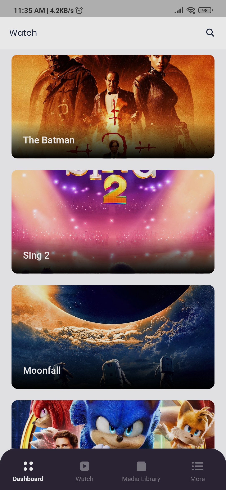
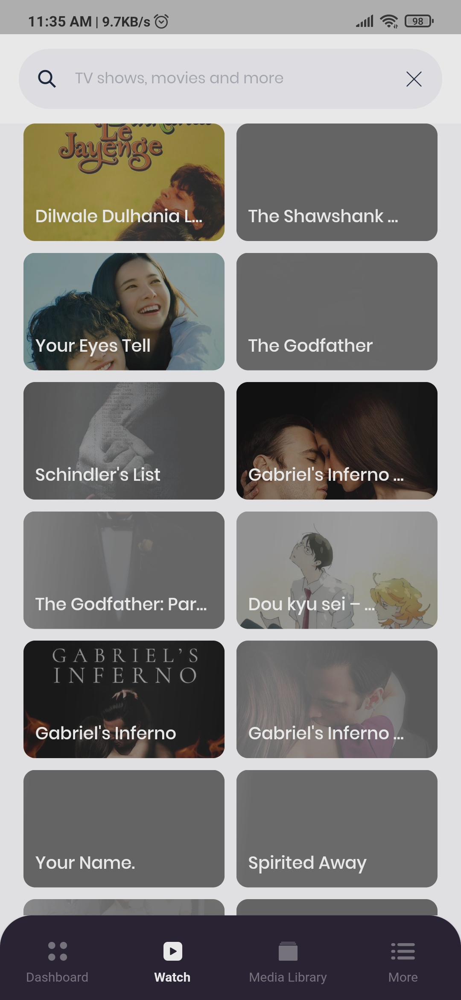
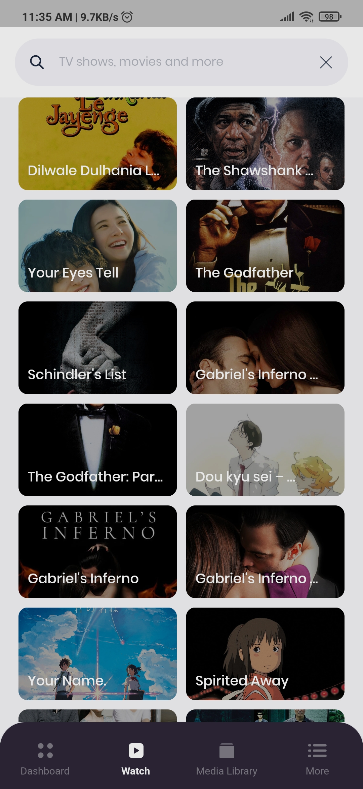
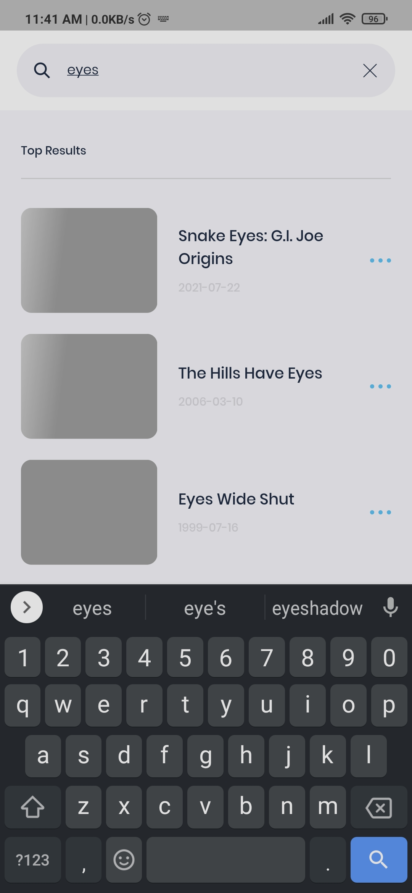
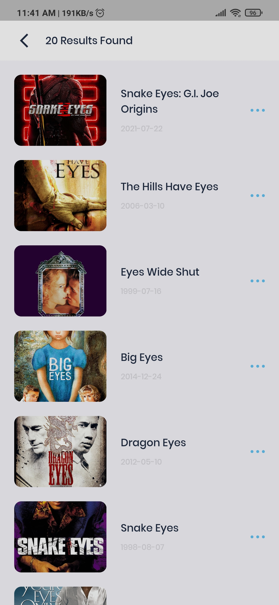
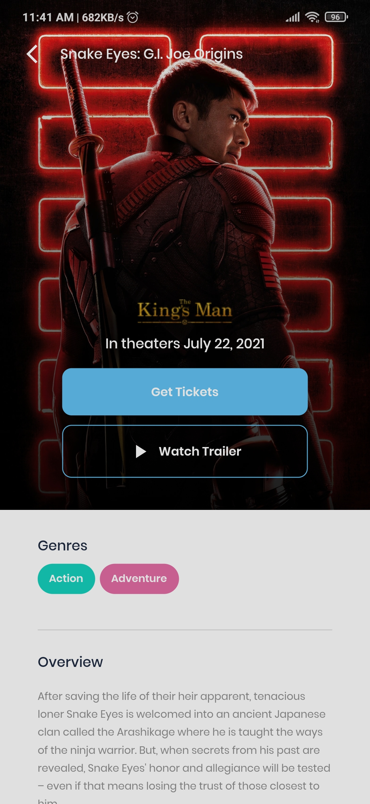
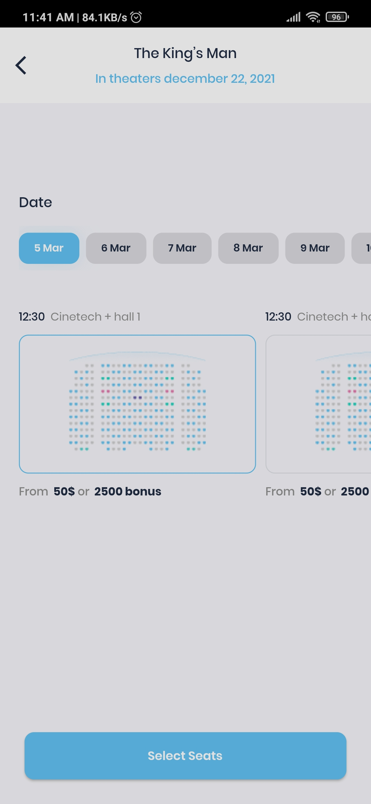
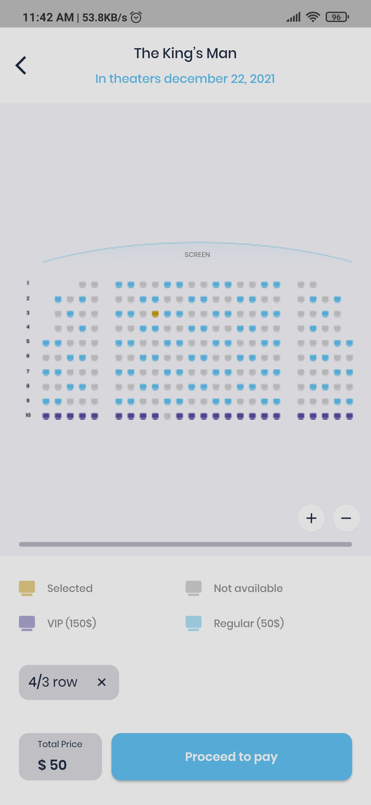

# Flutter Movie App

[Download Apk](https://drive.google.com/file/d/1Bre6gz8XWgDJuRnwyzPwVn7ZMZr8TBOr/view?usp=sharing)

 

[Demo App Video](https://drive.google.com/file/d/1M9Am84OuhczF9rblkHWa-OXYC61GA-UK/view)

 

[Code Structure Video](https://youtu.be/IfLQQcxKg1U)

## Project Features

The features I'm implemented. Those are -

- [Load Upcoming movie list]
- [Load top rated movie list]
- [Searching movie by keywords]
- [Get movie details]
- [Load images by movie id]
- [Animated UI]
- [Cache Data]

 

## Dependencies

- Provider (For state management)
- Cached network image
- Shimmer
- Equatable
- Flutter SVG
- Google Fonts
- Carousel Slider
- Api Cache Manager
- Animate do
- HTTP

 

## Screenshots

